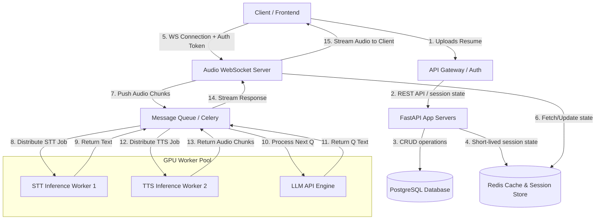

Listed directory AI_Mock_Interviewer
Listed directory backend
Listed directory app
Listed directory api
Listed directory v1
Viewed audio.py:1-53
Viewed interview.py:1-75
Listed directory core
Viewed stt_engine.py:1-29
Viewed tts_engine.py:1-22
Viewed session_store.py:1-47

# Architectural & Production Readiness Review
**Project:** AI Mock Interviewer (FastAPI, Faster-Whisper, Piper TTS, WebSockets)  
**Role:** Principal Backend Engineer

---

## 1. Architecture Score: `3.5 / 10`
* **Rationale:** While the workflow is straightforward and modularized into distinct files (`audio.py`, `interview.py`, `session_store.py`), the codebase contains multiple architectural red flags. Core engines are synchronous and blocking, state management is strictly in-memory, thread-safety is non-existent, and heavy model tasks share a single global, non-thread-safe inference context without queueing or offloading. 

## 2. Production Readiness Score: `2.0 / 10`
* **Rationale:** This system is effectively a prototype (Proof of Concept). It lacks authentication, persistent session storage, concurrency controls, rate limiting, connection cleanup, metrics, error resilience, and asynchronous processing for long-running CPU/GPU-bound tasks. It will crash or lock up under even mild concurrent usage.

---

## 3. Top 10 Concerns (Detailed Architectural Breakdown)

### 1. In-Memory Session Store (`MemorySessionStore` is Non-Thread-Safe & Non-Distributed)
* **Severity:** **Critical**
* **The Problem:** The `MemorySessionStore` manages session state in a plain Python dictionary (`self._sessions`) without any locking mechanisms (e.g., `asyncio.Lock` or standard threading locks). Furthermore, because the store is in-process memory, the application cannot scale horizontally (adding more containers/nodes).
* **SOLID/SoC Violations:** Violates *Single Responsibility Principle* (acting as database + transaction boundary in a shared state environment) and prevents scaling.
* **Real-World Impact:** 
  1. **Race Conditions / Data Loss:** If a user makes rapid, overlapping requests (e.g., submitting an answer while a background WebSocket event is modifying session metadata), memory updates will overwrite each other.
  2. **Zero Horizontal Scalability:** Traffic spike requires launching a second server instance. A request sent to Server B for a session created on Server A fails with a `404 Session Not Found` error.
  3. **No Resilience:** Any application crash, restart, or deployment wipes out all ongoing interviews.
* **Better Design:** Use a fast key-value store like **Redis** (storing serialized session models as JSON with a TTL). Apply distributed locks (e.g., Redlock) or leverage atomic transactional operations if updates occur concurrently.

### 2. Blocking CPU/GPU Inference on FastAPI Event Loop
* **Severity:** **Critical**
* **The Problem:** `STTEngine.transcribe()` and `TTSEngine.speak()` run Whisper and Piper inference synchronously on the main thread. Faster-Whisper's `.transcribe()` is a CPU/GPU-intensive operation. Piper TTS's `.synthesize()` is similarly intensive. Because they are not run asynchronously (e.g., via a thread pool or task queue), they block FastAPI's single-threaded event loop.
* **Real-World Impact:** During transcription (which can take 500ms to 2s depending on audio length and hardware), FastAPI cannot process *any other incoming network requests, WebSocket frames, or health checks*. For 100 concurrent users, the application becomes completely unresponsive, resulting in HTTP gateways timing out (504 Gateway Timeout).
* **Better Design:** Offload inference to a worker queue (e.g., Celery, RQ, or a custom background worker pool) or run synchronous, CPU-bound model calls in a secondary executor using `asyncio.to_thread()` or `loop.run_in_executor(ProcessPoolExecutor)`.

### 3. Audio Transcribe Loop Logic Bug (`test = ""` vs `text += ...`)
* **Severity:** **Critical**
* **The Problem:** In [stt_engine.py](file:///c:/Users/shash/OneDrive/Documents/Desktop/ChatBoy/AI_Mock_Interviewer/backend/app/core/stt_engine.py#L17-L19), the variable is initialized as `test = ""` on line 17, but line 19 attempts to append to `text += segment.text`. This raises a `NameError: name 'text' is not defined` on the very first transcription attempt.
* **Real-World Impact:** The `/audio/stream` endpoint will immediately throw an exception, disconnect the WebSocket, and fail to transcribe any user speech.
* **Better Design:** Correct the typo: initialize `text = ""` instead of `test = ""`. Additionally, write unit tests for the transcription pipeline to catch syntax/name errors during CI/CD.

### 4. Direct CUDA Inference Concurrency Issues (Shared Shared Engine without Serialization)
* **Severity:** **Critical**
* **The Problem:** The Faster-Whisper and Piper models are instantiated once at startup and stored in `app.state`. When multiple WebSockets handle incoming audio concurrently, they simultaneously invoke `stt_engine.transcribe()` or `tts_engine.speak()` on the same instance. Whisper/CUDA contexts are generally not thread-safe or re-entrant when triggered simultaneously by multiple concurrent coroutines without serialization.
* **Real-World Impact:** Under concurrent load, this triggers CUDA memory faults, segmentation faults (crashing the entire python process), or mixed/corrupted transcripts where one user's transcription outputs bleed into another's.
* **Better Design:** Protect the shared inference engines with an `asyncio.Lock` per model, or route audio frames to a queue processed by a dedicated worker pool where each worker process owns its own CUDA/CPU instance of the model.

### 5. Memory Leaks & Unbounded Buffers in Audio Streaming
* **Severity:** **High**
* **The Problem:** In [audio.py:L12-L31](file:///c:/Users/shash/OneDrive/Documents/Desktop/ChatBoy/AI_Mock_Interviewer/backend/app/api/v1/audio.py#L12-L31), the `audio_buffer` accumulates raw bytes. Transcription is triggered only when `len(audio_buffer) >= BUFFER_SIZE`. If a user streams audio but never hits `BUFFER_SIZE` (1MB), and then closes the socket or stops speaking, the buffer is never processed. Conversely, if a client keeps streaming audio indefinitely without closing the connection, the buffer could grow indefinitely if not cleared properly, consuming unbounded memory.
* **Real-World Impact:** Audio transcripts will feel extremely laggy (only updating in 1MB increments, which is ~30+ seconds of uncompressed audio). If a socket disconnects abruptly, the unsaved buffer is lost. Unbounded accumulation causes out-of-memory (OOM) crashes on the server.
* **Better Design:** Implement a sliding window or time-based chunking mechanism (e.g., transcribe every 1-2 seconds of silence, or every 16,000 raw samples / 32KB). Use a WebRTC-based VAD (Voice Activity Detection) library (e.g., `pyannote` or `webrtcvad`) to detect speech boundaries, and clear/transcribe on boundary markers rather than arbitrary byte lengths.

### 6. Client-Side Control of Session Termination & Security Vulnerability
* **Severity:** **High**
* **The Problem:** The transition from audio streaming to text response relies on the client calling `POST /interview/answer` with transcript text stored in frontend memory, and ending the interview relies on the client calling `POST /interview/end`. If the frontend is compromised or contains bugs, users can modify their transcripts, skip questions, or leave interviews in an orphaned "active" state indefinitely.
* **Real-World Impact:** Malicious users can cheat by editing transcripts before submitting them. Orphaned sessions leak resources (memory, open connections) because there is no backend-enforced session timeout.
* **Better Design:** The backend must be the source of truth. The backend should accumulate the transcripts during the WebSocket session. When the user stops speaking (detected via VAD on backend or a signed "Done" websocket frame), the backend runs STT on the complete audio buffer, updates the database directly, runs the LLM, and responds. The frontend should never possess raw edit control over the finalized transcript.

### 7. Poor WebSocket Lifecycle Management (No Cleanup)
* **Severity:** **Medium**
* **The Problem:** The WebSocket endpoints accept connection requests blindly. There is no verification that the user is authorized to join the session, nor is the WebSocket tied to an active session ID (there is no `session_id` parameter or validation in the `/audio/stream` route).
* **Real-World Impact:** Anyone can open WebSocket streams, consuming GPU/CPU processing power. Furthermore, if a WebSocket disconnects, there is no mechanism to release associated session locks or mark the session as interrupted.
* **Better Design:** Redesign routes to include session validation: `@router.websocket("/stream/{session_id}")`. Authenticate the connection (e.g., via a short-lived token passed in the query string or headers) and verify that the session is active before accepting the WebSocket connection.

### 8. Monolithic Design of TTS Output (Blocking Generators)
* **Severity:** **Medium**
* **The Problem:** In `/audio/speak`, the TTS engine streams raw chunk bytes back to the frontend. However, `tts_engine.speak` (triggered by `tts_engine.stream` on line 46) is a synchronous generator. If generation of subsequent audio chunks takes time, the main event loop continues to block.
* **Real-World Impact:** The backend experiences high latency spikes whenever a long sentence is synthesized, impacting the response times of all other users sharing that container.
* **Better Design:** Synthesize audio in a background executor, yielding chunks asynchronously (`async for` with `await asyncio.sleep(0)` or queue-based consumers) or pre-generate the entire response asynchronously and cache the audio files in a CDN (e.g., S3 + CloudFront) for playback if questions are standard.

### 9. Question Bank Generation is a Single Point of Failure (SPOF)
* **Severity:** **High**
* **The Problem:** The resume upload flow generates the entire question bank up front. If the LLM call or parsing fails halfway through, the session is bricked. In addition, generating a static bank of questions limits dynamic adaptiveness to the candidate's active performance.
* **Real-World Impact:** High latency during the initial resume upload step (since generating 10+ questions takes 5-15 seconds of LLM execution). If the user leaves the page during this slow load, LLM costs are incurred for nothing.
* **Better Design:** Generate the first question instantly based on the resume. Generate subsequent questions dynamically on-the-fly (just-in-time) based on the candidate's answers and resume context, caching candidate profiles in a structured database.

### 10. Lack of Quality of Service (QoS) & Concurrency Limits
* **Severity:** **Medium**
* **The Problem:** Audio/Video streaming and ML model inference are resource-heavy operations. The system currently lacks any rate-limiting, request queueing, or connection limits.
* **Real-World Impact:** A simple script launching 50 concurrent WebSockets will overwhelm the GPU/CPU memory, cause core dump failures, and bring down the entire application stack.
* **Better Design:** Implement rate limiting (e.g., `slowapi`) and limit the maximum number of concurrent WebSocket audio sessions per server instance (using a counter/semaphore). Return a `503 Service Unavailable` or `Busy` message if resources are saturated.

---

## 4. Suggested Improvements (Priority Order)

1. **Fix the STT Engine Bug:** Correct the `test = ""` typo to `text = ""` in [stt_engine.py](file:///c:/Users/shash/OneDrive/Documents/Desktop/ChatBoy/AI_Mock_Interviewer/backend/app/core/stt_engine.py#L17-L19) immediately so the basic loop functions.
2. **Move to Redis/Database Storage:** Replace the in-memory dictionary with Redis (for active session states, transient audio chunks) and a persistent SQL database (PostgreSQL) for user data and completed interviews.
3. **Isolate ML Inference from the Web Server:** Do not run Whisper/Piper inside the FastAPI web process. Extract them into a worker pool (Celery + Redis/RabbitMQ) or deploy them behind dedicated microservices (e.g., Triton Inference Server, Ray Serve, or lightweight FastAPI worker containers running on separate GPU instances).
4. **Implement Voice Activity Detection (VAD) & Sliding Window Buffering:** Replace the 1MB buffer with a buffer that processes chunks when a silence interval (e.g., 500ms of non-speech) is detected.
5. **Secure and Validate WebSockets:** Ensure all WebSocket connections authenticate the client and bind to a valid `session_id`.

---

## 5. What Should Be Changed Before Frontend Development Begins

Before the frontend team writes code, the API contracts must be stable. Change the following first:

1. **WebSocket Route Paths:** Change `/audio/stream` and `/audio/speak` to accept a `session_id` query parameter (e.g., `/audio/stream/{session_id}`) to ensure the backend can link audio streams directly to session states.
2. **Shift Transcript Storage to Backend:** Eliminate the pattern of the frontend holding, editing, and submitting the transcript text via `POST /interview/answer`. Instead, the frontend should stream audio. The backend transcribes it, accumulates it in the session store, and when the user is done (either via "Answer Complete" event or VAD), the backend evaluates it. The frontend API call `POST /interview/answer` should only require a `session_id` (not the full transcript text).
3. **Unify Audio and Text into a Single Protocol (Optional but Recommended):** Consider using a single bidirectional WebSocket for the interview loop rather than separate REST endpoints and separate WebSockets. This simplifies frontend state management.

---

## 6. What Can Safely Wait Until Later Phases

1. **Fully Automated VAD:** You can keep the "Answer Complete" button for V1. Just fix the buffer mechanics to stream transcripts progressively (incremental updates) instead of waiting for a 1MB block.
2. **Advanced Analytics & Evaluation Reports:** Generating deep candidate evaluations can run asynchronously after `POST /interview/end` and can be built out later.
3. **Triton Inference Server Migration:** For the prototype/early beta, running inference in separate Python background threads/processes is acceptable. Porting to Triton/Ray can wait until scale warrants it.

---

## 7. Will it survive 100 concurrent interview sessions?
**No.** 
* **Reason:** Faster-Whisper (base model) and Piper TTS running on CUDA inside a single-process FastAPI loop will completely lock up. Because both engines are run synchronously in the request path, 100 concurrent users sending audio chunks will run out of GPU memory (CUDA OOM) or deadlock the FastAPI event loop, causing requests to time out. Additionally, the non-thread-safe dictionary operations will trigger race conditions.

## 8. Will it survive 1000 concurrent interview sessions?
**Absolutely not.**
* **Reason:** It will crash almost instantly. 1,000 WebSocket connections will exhaust file descriptors, run out of memory due to multiple 1MB buffers per connection, trigger massive race conditions in the dictionary store, and crash the CUDA runtime due to concurrent thread access.

---

## 9. Endpoint Redesign Recommendations

### `POST /interview/answer`
* **Current:** Receives client-side transcript text.
* **Redesign:** Remove the transcript from the request body. The request should just contain `{ "session_id": "uuid" }`. The backend retrieves the accumulated transcript generated by the backend STT engine during the WebSocket stream. This prevents cheating and client-side transcription tampering.

### `WS /audio/stream` -> `WS /interview/stream/{session_id}`
* **Current:** Blind connection, no authentication, 1MB byte-chunk buffering.
* **Redesign:** Change to `/interview/stream/{session_id}?token=JWT`. Use an event-based framing protocol over the WebSocket (e.g., sending binary audio packets, and receiving text-based JSON status packets containing intermediate transcripts).

---

## 10. Proposed Improved Architecture Diagram

